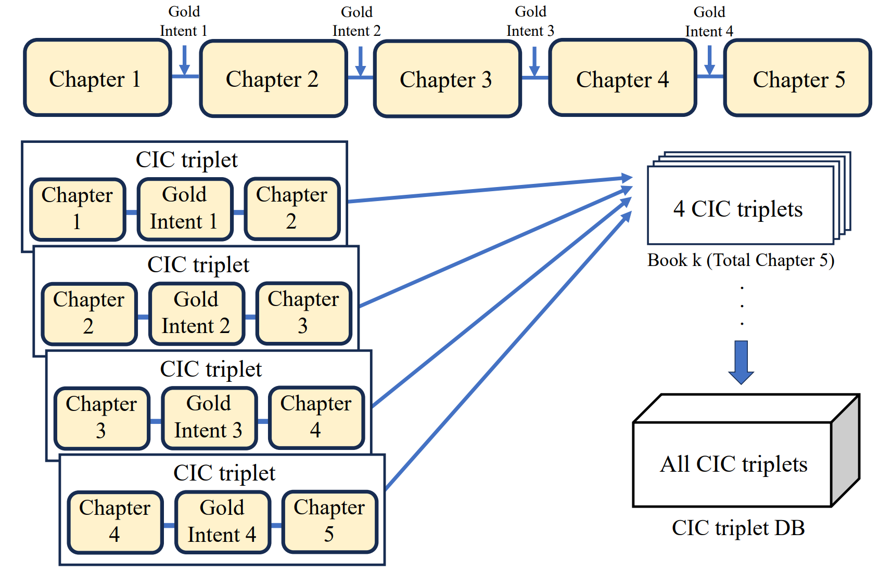
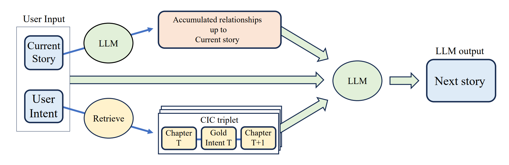

# C3ICT:Creating the next story from the Current story and the retrieved Chapter-Intent-Chapter Triplet. 

This repo contains code for C3ICT:Creating the next story from the Current story and the retrieved Chapter-Intent-Chapter Triplet.




### Preparation

First, you will need an OpenAPI key. Enter your key in the format 'sk-xxxx...' in the .env_sample file.
```
OPENAI_API_KEY='sk-xxxx...'
```
Then, rename the .env_sample file to .env.

## Simple start

If you want to test our pipeline(C3ICT) through the Gradio web application, use the link that opens from
```
main_gradio.py
```


If you want to directly check all the output processes in the terminal window, use
```
main_full_pipeline.py
```
As you can see in main_full_pipeline.py, when interacting through the terminal, first enter the initial story. Then, freely write the intent for the next story. The model will then generate the next story and ask if you want to save and exit (by entering 's') or continue. If you want to continue, enter any other key and freely write the intent for the next story again. You can repeat the story as much as you like, and when you want to stop, enter 's' to save and exit. The saved file will be located in the results folder.

## Intent example

- Write the backstory of this man.
- Write a story with an urgent plot twist.
- Describe the world of this story in detail.
- Write the inner monologue of this character.

Feel free to input other creative intents to write the next story based on the current one!

## Data

#### Instructions
The txt files in the instructions folder are the provided instructions as input.

#### CIC Triplet DB
The merged_DB_vector.json in the intent_DB_vector folder contains all the CIC triplets (with intents vectorized) and the source book's Gutenberg Plain Text UTF-8 links.

#### Base Story and Base Intent - Experiment
The 25 json files in the base_story_intent_augmented_DB folder are a collection of the base stories and base intents we used in the experiment.

#### RAG Story - Experiment
The 25 json files in the base_story_RAG_results folder are a collection of RAG stories generated by our module (C3ICT) at each point of the base story and base intent. These stories are datasets for comparing step-by-step generation results, and it is normal that there is no connectivity between the stories!

#### UPWORK evaluation Data - Experiment
The 25 json files in the UPWORK_data folder each contain 4 sets of base story, intent, next base story (A), and next RAG story (B) for survey questions. Twelve evaluators were divided into 4 teams of 3 members each and distributed these sets according to their team index, with each evaluator assessing 25 sets. The evaluation results showed that the next RAG story (B) was superior to the next base story (A). All evaluation information is in the upwork_result.csv file in the UPWORK_data folder.
